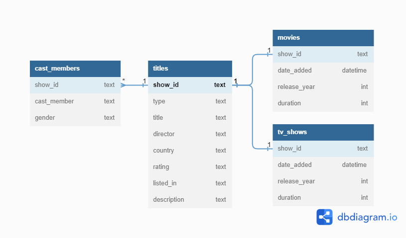

# Data Engineer Task

## Step 1 : Create a database to store the data using a Dimensional Modeling Design. (MSSQL / MySQL / Postgres)

### Data Model

+ I chose to create the table "cast_members", with one record for each cast member because the original format (list of people for each title) is not practical for any kind of analysis. 
+ I also designed two dimension tables, "movies" and  "tv_shows", firstly because the analyzes will probably focus on one option or the other, so this division will improve query performance, but also because the feature "duration" needs different treatment in each case, for movies it refers to duration in minutes, and for tv shows to the number of seasons.

### Database

I choose to create a Postgres database in Docker. This way (considering the small dataset volume) it's possible to map the db volume to a folder inside this repository, and anyone with docker installed can clone it and access the database.

Inside "Linkfire_data_engineer_task/database" folder you will find the docker-compose.yaml file, containing instructions for:
+ Set up the Postgres database "netflix_db" with volume mapped to "Linkfire_data_engineer_task/database/volume"
+ Set up PgAdmin local server, to easily query "netflix_db"

After running "docker-compose up" you will be able to access PgAdmin at http://localhost:8080/ with credentials:
+ PgAdmin e-mail: admin@admin.com
+ PgAdmin password: root
+ host: pgdatabase
+ Postgres username: root
+ Postgres password: root

***The SQL Scripts that will be used in the creation of the data model can be found at "Linkfire_data_engineer_task/sql_queries/DDL_queries/"***

## Step 2 : Create a python programme that will run the above SQL scripts and ETL the data from the csv file into the database.

The Python Script "update-data.py" will run a pipeline to create all tables of the data model and ETL the csv data into the database.

A few details of the main functions in the pipeline:

***execute_ddl_statements():***
+ Run SQL Scripts
+ Used to create tables keeping an organized history of the scripts

***load_input():***
+ Load the csv file with the option to remove records already present in the db, avoiding inserting duplicate records

***update_table_title()***
+ selects columns and inserts data into table "titles"

***update_table_movies():***
+ Treat and convert date_added (timestamp)
+ Convert duration to movie length in minutes (int)
+ Inserts data into table "movies"

***update_table_tv_shows():***
+ Treat and convert date_added (timestamp)
+ Convert duration to number of seasons (int)
+ Inserts data into table "tv_shows"

## **Step 3** : Enhance the data by adding the cast members' gender (Male / Female). [https://www.aminer.cn/gender/api](https://www.aminer.cn/gender/api) or any other source you want to use.

The first part of this step consisted of preparing a DataFrame with one record for each cast member, making requests easier and preparing the base of the table "tv_shows". This was done with the function create_cast_members_df() inside update-data.py

The second part of the task consisted of generating the gender feature. First I created a simple function named  gender_feature() that performs the request and organizes the results in a DataFrame. But after some tests I quickly realized that it would be unfeasible to go with just this solution. It took 741s to run 100 requests, considering there are 56,673 names to search, **it would take approximately 116 hours to complete the process.**

The long runtime is justified by the waiting time for the request response, and not by the required processing power. So, the solution I found was to put the requests inside a multi threading process, which is the most efficient way to take advantage of idle times during execution. **Running 100 threads it was possible to reduce the execution time from 116h to 1:18h**

The multi threading process was defined in the function threading_gender_request(), then i finally created the function update_table_cast_members() to update the data in the table "tv_shows"

## Step 4 : Write SQL Scripts to validate the data loaded.

### SQL Scripts

Inside the folder "Linkfire_data_engineer_task/sql_queries/validate_output_queries" you will find 8 SQL Scripts, 4 to check for null values and 4 to check for invalid data (1 for each table)

**Scripts to check for null values will:**
+ Check NULL values quantity for each columns in each table
+ Check NULL values percentage for each columns in each table

**Scripts to check for invalid data will check different features for each table:**

***Table "title":***
+ col "type" -- qty of records != "Movie" or != 'TV Show'

***Table "tv_shows":***
+ col "season_qty" -- qty of records <0 or >30
+ col "release_year" -- qty of records <1900 or > current year 
+ col "date_added -- qty of records <'1997-01-01' or > current date
+ col "release_year"/"date_added" -- qty of records with date_added > release_year

***Table "movies"***
+ col "movie_length_min" -- qty of records <0 or >500
+ col "release_year" -- qty of records <1900 or > current year 
+ col "date_added -- qty of records <'1997-01-01' or > current date
+ col "release_year"/"date_added" -- qty of records with date_added > release_year

***Table cast_members:***
+ col "gender" -- qty of records == "UNKNOWN"
+ col "gender" -- % of records == "UNKNOWN"
+ col "gender" -- qty of records == "request_failed"
+ col "gender" -- % of records == "request_failed"

### Report

To generate reports from the queries described above, I created the Python program "output_report.py". This program basically run all the queries and with the results generates two formatted txt files in the folder "Linkfire_data_engineer_task/reports":
+ null_values_report
+ invalid_data_report

## Step 5 : Write SQL Scripts to return the following:

+ What is the most common first name among actors and actresses?
+ Which Movie had the longest timespan from release to appearing on Netflix?
+ Which Month of the year had the most new releases historically?
+ Which year had the largest increase year on year (percentage wise) for TV Shows?
+ List the actresses that have appeared in a movie with Woody Harrelson more than once.

**The SQL Scripts that answer each of those questions can be found at "Linkfire_data_engineer_task/sql_queries/analysis_queries/"**

Furthermore, in the file output_report.py the function "create_analytical_report()" was added.

This function will be responsible for executing the queries that answer the questions above and organizing the results in a report in .txt format

The report can be found at "Linkfire_data_engineer_task/reports/" with the name **"analytical_report_" + generation date + ".txt"**

## **Step 6** : Combine all the previous steps into a solid Python programme that has unit testing. Feel free to create a main file that can be ran via a Python command line.

The main task of this stage was the creation of the unit tests. 

I decided to create two tests:
+ Input tests (test_netflix_pipeline_input.py): guarantee the quality of the data in the extraction phase
+ Output tests (test_netflix_pipeline_output.py): guarantee that we will have the expected behavior of the functions responsible for transforming data and updating the db, with the goal of maintaining the data quality of data inserted in the db and helping in the development of possible updates in the code.

### Input Tests

The following tests were designed:
+ Check if database connection is available
+ Check if Input column names are as expected
+ Tests for missing values in columns show_id and type
+ Check for duplicate show_id
+ Test if date format in field date_added are as expected 
+ Checks if there are only two titles types:"TV Show" or "Movie"

### Output Tests

For the output, I designed tests for each function that transforms or extracts data

To run the tests, I randomly load 1% of the input data, reducing the processing required to run the tests while maintaining virtually the same results.

The tests check the following points:

***Test the function update_data.create_cast_members_df()***
+ Consistency in the number of titles
+ Columns names
+ Data types

***Test the function update_data.test_threading_gender_request()***
+ API connection
+ API results
+ Columns names
+ Data types

***Test the function update_data.update_table_title()***
+ Columns names
+ Data types

***Test the function update_data.update_table_movies()***
+ Columns names
+ Data types

***Test the function update_data.update_tv_shows()***
+ Columns names
+ Data types

### main.py

Finally, I created the main.py to combine all the previous steps.

The program will run the steps in this order:
+ Run input testes
+ Run output testes
+ Run ETL pipeline
+ Generate all reports
